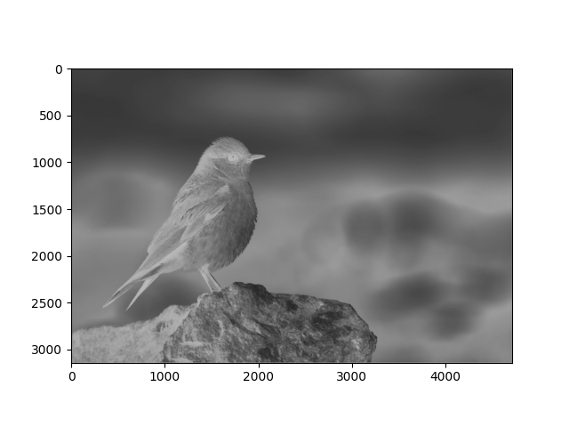
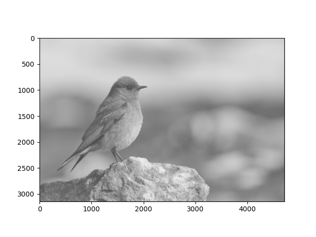

# CNN Feature Map Visualization

This project visualizes the feature map which is commonly used in Convolutional Neural Networks. Given an image, we get a random feature map as it initializes the kernel randomly.


## Run Locally

Clone the project

```bash
  git clone https://github.com/Hemanthhari2000/CNN_feature_map_visualization.git
```

Go to the project directory

```bash
  cd my-project
```

Install packages

```bash
  pip install -r requirements.txt
```

Run the app

```bash
  python cnn_feature_visualization.py
```

  
## Screenshots

Image:


Kernel:

```
[[-2 -2 -1]
 [ 0 -3 -2]
 [ 0  0  3]]
 ```




Kernel:

```
[[-1 -1  4]
 [ 2  0 -3]
 [ 3  3 -2]]
```


  